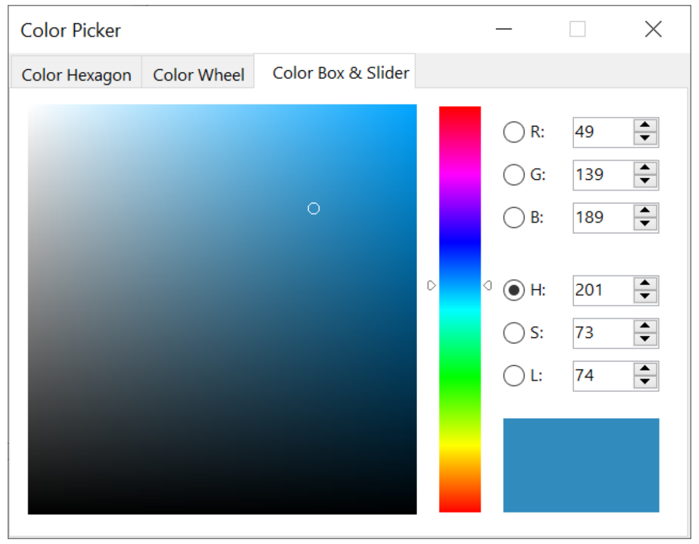
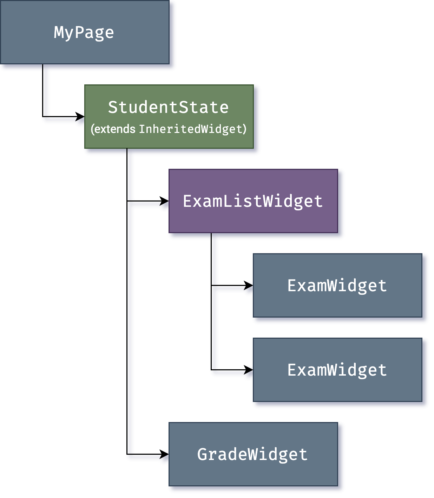

# `flutter`简介

## `flutter`架构概览

Flutter 是一个跨平台的 UI 工具集，它的设计初衷，就是允许在各种操作系统上复用同样的代码，例如 iOS 和 Android，同时让应用程序可以直接与底层平台服务进行交互。如此设计是为了让开发者能够在不同的平台上，都能交付拥有原生体验的高性能应用，尽可能地共享复用代码的同时，包容不同平台的差异。

在开发中，Flutter 应用会在一个 VM（程序虚拟机）中运行，从而可以在保留状态且无需重新编译的情况下，热重载相关的更新。对于发行版 (release) ，Flutter 应用程序会直接编译为机器代码（Intel x64 或 ARM 指令集），或者针对 Web 平台的 JavaScript。 Flutter 的框架代码是开源的，遵循 BSD 开源协议，并拥有蓬勃发展的第三方库生态来补充核心库功能。

概览分为以下几部分内容：

1. **分层模型**：Flutter 的构成要素。
2. **响应式用户界面**：Flutter 用户界面开发的核心概念。
3. **widgets 介绍**：构建 Flutter 用户界面的基石。
4. **渲染过程**：Flutter 如何将界面布局转化为像素。
5. **平台嵌入层 的概览**：让 Flutter 应用可以在移动端及桌面端操作系统执行的代码。
6. **将 Flutter 与其他代码进行集成**：Flutter 应用可用的各项技术的更多信息。
7. **Web 支持**：Flutter 在浏览器环境中的特性的概述。

## 架构层

Flutter 被设计为一个可扩展的分层系统。它可以被看作是各个独立的组件的系列合集，上层组件各自依赖下层组件。组件无法越权访问更底层的内容，并且框架层中的各个部分都是可选且可替代的。


对于底层操作系统而言，Flutter 应用程序的包装方式与其他原生应用相同。在每一个平台上，会包含一个特定的嵌入层，从而提供一个程序入口，程序由此可以与底层操作系统进行协调，访问诸如 surface 渲染、辅助功能和输入等服务，并且管理事件循环队列。该嵌入层采用了适合当前平台的语言编写，例如 Android 使用的是 Java 和 C++， iOS 和 macOS 使用的是 Objective-C 和 Objective-C++，Windows 和 Linux 使用的是 C++。 Flutter 代码可以通过嵌入层，以模块方式集成到现有的应用中，也可以作为应用的主体。 Flutter 本身包含了各个常见平台的嵌入层，同时也 存在一些其他的嵌入层。

**Flutter 引擎** 毫无疑问是 Flutter 的核心，它主要使用 C++ 编写，并提供了 Flutter 应用所需的原语。当需要绘制新一帧的内容时，引擎将负责对需要合成的场景进行栅格化。它提供了 Flutter 核心 API 的底层实现，包括图形（在 iOS 和 Android 上通过 Impeller，在其他平台上通过 Skia）、文本布局、文件及网络 IO、辅助功能支持、插件架构和 Dart 运行环境及编译环境的工具链。

引擎将底层 C++ 代码包装成 Dart 代码，通过 dart:ui 暴露给 Flutter 框架层。该库暴露了最底层的原语，包括用于驱动输入、图形、和文本渲染的子系统的类。

通常，开发者可以通过 Flutter 框架层 与 Flutter 交互，该框架提供了以 Dart 语言编写的现代响应式框架。它包括由一系列层组成的一组丰富的平台，布局和基础库。从下层到上层，依次有：

- 基础的 foundational 类及一些基层之上的构建块服务，如 animation、 painting 和 gestures，它们可以提供上层常用的抽象。
- 渲染层 用于提供操作布局的抽象。有了渲染层，你可以构建一棵可渲染对象的树。在你动态更新这些对象时，渲染树也会自动根据你的变更来更新布局。
- widget 层 是一种组合的抽象。每一个渲染层中的渲染对象，都在 widgets 层中有一个对应的类。此外，widgets 层让你可以自由组合你需要复用的各种类。响应式编程模型就在该层级中被引入。
- Material 和 Cupertino 库提供了全面的 widgets 层的原语组合，这套组合分别实现了 Material 和 iOS 设计规范。

Flutter 框架相对较小，因为一些开发者可能会使用到的更高层级的功能已经被拆分到不同的软件包中，使用 Dart 和 Flutter 的核心库实现，其中包括平台插件，例如 camera 和 webview；与平台无关的功能，例如 characters、 http 和 animations。还有一些软件包来自于更为宽泛的生态系统中，例如 应用内支付、 Apple 认证 和 Lottie 动画。

## 应用剖析

下图为你展示了一个通过 flutter create 命令创建的应用的结构概览。该图展示了引擎在架构中的定位，突出展示了 API 的操作边界，并且标识出了每一个组成部分。


### Dart 应用

- 将 widget 合成预期的 UI。
- 实现对应的业务。
- 由应用开发者进行管理。

### 框架（源代码）

- 提供了上层的 API 封装，用于构建高质量的应用（例如 widget、触摸检测、手势竞技、无障碍和文字输入）。
- 将应用的 widget 树构建至一个 Scene 中。

### 引擎（源代码）

- 将已经合成的 Scene 进行栅格化。
- 对 Flutter 的核心 API 进行了底层封装（例如图形图像、文本布局和 Dart 的运行时）
- 将其功能通过 dart:ui API 暴露给框架。
- 使用 嵌入层 API 与平台进行整合。

### 嵌入层（源代码）

- 协调底层操作系统的服务，例如渲染层、无障碍和输入。
- 管理事件循环体系。
- 将 特定平台的 API 暴露给应用集成嵌入层。

### 运行器

- 将嵌入层暴露的平台 API 合成为目标平台可以运行的应用包。
- 部分内容由 flutter create 生成，由应用开发者进行管理。

## 响应式用户界面

Flutter 是 一个响应式的且伪声明式的 UI 框架，开发者负责提供应用状态与界面状态之间的映射，框架则在运行时将应用状态的更改更新到界面上。这样的模型架构的灵感来自 Facebook 自己的 React 框架 ，其中包含了对传统设计理念的再度解构。

在大部分传统的 UI 框架中，界面的初始状态通常会被一次性定义，然后，在运行时根据用户代码分别响应事件进行更新。在这里有一项大挑战，即随着应用程序的复杂性日益增长，开发者需要对整个 UI 的状态关联有整体的认知。让我们来看看如下的 UI：



很多地方都可以更改状态：颜色框、色调滑条、单选按钮。在用户与 UI 进行交互时，状态的改变可能会影响到每一个位置。更糟糕的是，UI 的细微变动很有可能会引发无关代码的连锁反应，尤其是当开发者并未注意其关联的时候。

我们可以通过类似 MVC 的方式进行处理，开发者将数据的改动通过控制器（Controller）推至模型（Model），模型再将新的状态通过控制器推至界面（View）。但这样的处理方式仍然存在问题，因为创建和更新 UI 元素的操作被分离开了，容易造成它们的不同步。

Flutter 与其他响应式框架类似，采用了显式剥离基础状态和用户界面的方式，来解决这一问题。你可以通过 React 风格的 API，创建 UI 的描述，让框架负责通过配置优雅地创建和更新用户界面。

在 Flutter 里，widgets（类似于 React 中的组件）是用来配置对象树的不可变类。这些 widgets 会管理单独的布局对象树，接着参与管理合成的布局对象树。 Flutter 的核心就是一套高效的遍历树的变动的机制，它会将对象树转换为更底层的对象树，并在树与树之间传递更改。

build() 是将状态转化为 UI 的方法，widget 通过重写该方法来声明 UI 的构造：

```dart
UI = f(state)
```

`build()` 方法在框架需要时都可以被调用（每个渲染帧可能会调用一次），从设计角度来看，它应当能够快速执行且没有额外影响的。

## `Widgets`

Flutter 强调以 widgets 作为组成单位。 Widgets 是构建 Flutter 应用界面的基础块，每个 widget 都是一部分不可变的 UI 声明。

Widgets 通过布局组合形成一种层次结构关系。每个 Widget 都嵌套在其父级的内部，并可以通过父级接收上下文。从根布局（托管 Flutter 应用的容器，通常是 MaterialApp 或 CupertinoApp）开始，自上而下都是这样的结构，如下面的示例所示：

```dart
import 'package:flutter/material.dart';
import 'package:flutter/services.dart';

void main() => runApp(const MyApp());

class MyApp extends StatelessWidget {
  const MyApp({super.key});

  @override
  Widget build(BuildContext context) {
    return MaterialApp(
      home: Scaffold(
        appBar: AppBar(
          title: const Text('My Home Page'),
        ),
        body: Center(
          child: Builder(
            builder: (context) {
              return Column(
                children: [
                  const Text('Hello World'),
                  const SizedBox(height: 20),
                  ElevatedButton(
                    onPressed: () {
                      print('Click!');
                    },
                    child: const Text('A button'),
                  ),
                ],
              );
            },
          ),
        ),
      ),
    );
  }
}
```

在上面的代码中，所有实例化的类都是 widgets。

应用会根据事件交互（例如用户操作），通知框架替换层级中的旧 widget 为新 widget，然后框架会比较新旧 widgets，高效地更新用户界面。

Flutter 拥有其自己的 UI 控制实现，而不是由系统自带的方法进行托管：例如， iOS 的 Toggle 控件 有一个 对应的 widget， Android 的选择控件 有一个 对应的 widget。

这样的实现有几个优势：

- 提供了无限的扩展性。当开发者想要一个 Switch 的改装时，他们可以以任意方式创建一个，而不被系统提供的扩展所限制。
- Flutter 可以直接合成所有的场景，而无需在 Flutter 与原生平台之间来回切换，从而避免了明显的性能瓶颈。
- 将应用的行为与操作系统的依赖解耦。在任意一种系统平台上体验应用，都将是一致的，就算某个系统更改了其控件的实现，也是如此。

### 组成

Widgets 通常由更小的且用途单一的 widgets 组合而成，提供更强大的功能。

在设计时，相关的设计概念已尽可能地少量存在，而通过大量的内容进行填充。（译者注：即以最小的原语加最多的单一实现创造出最大的价值。）举个例子，Flutter 在 widgets 层中使用了相同的概念（一个 Widget）来表示屏幕上的绘制、布局（位置和大小）、用户交互、状态管理、主题、动画及导航。在动画层，Animation 和 Tween 这对概念组合，涵盖了大部分的设计空间。在渲染层，RenderObject 用来描述布局、绘制、触摸判断及可访问性。在这些场景中，最终对应包含的内容都很多：有数百个 widgets 和 render objects，以及数十种动画和补间类型。

类的层次结构是有意的浅而广，以最大限度地增加可能的组合数量，重点放在小的、可组合的 widget 上，确保每个 widget 都能很好地完成一件事情。核心功能均被抽象，甚至像边距和对齐这样的基础功能，都被实现为单独的组件，而不是内置于核心中。（这样的实现也与传统的 API 形成了对比，类似边距这样的功能通常都内置在了每个组件的公共核心内， Flutter 中的 widget 则不同。）因此，如果你需要将一个 widget 居中，与其调整 Align 这样的属性，不如将它包裹在一个 Center widget 内。

Flutter 中包含了边距、对齐、行、列和网格系列的 widgets。这些布局类型的 widgets 自身没有视觉内容，而只用于控制其他 widgets 的部分布局条件。 Flutter 也包含了以这种组合方法组成的实用型 widgets。

例如，一个常用的 widget Container，是由几个 widget 组合而成，包含了布局、绘制、定位和大小的功能。更具体地说，Container 是由 LimitedBox、 ConstrainedBox、 Align、 Padding、 DecoratedBox 和 Transform 组成的，你也可以通过查看源码看到这些组合。 Flutter 有一个典型的特征，即你可以深入到任意一个 widget，查看其源码。因此，你可以通过同样的方式组合其他的 widgets，也可以参考 Container 来创建其他的 widget，而不需要继承 Container 来实现自定义的效果。

### 构建 widgets

先前提到，你可以通过重写 build() 方法，返回一个新的元素树，来定义视觉展示。这棵树用更为具体的术语表示了 widget 在 UI 中的部分。例如，工具栏 widget 的 build 方法可能会返回 水平布局，其中可能包含一些 文字， 各种各样 的 按钮。根据需要，框架会递归请求每个 widget 进行构建，直到整棵树都被 具体的可渲染对象 描述为止。然后，框架会将可渲染的对象缝合在一起，组成可渲染对象树。

Widget 的 build 方法应该是没有副作用的。每当一个方法要求构建时， widget 都应当能返回一个 widget 的元素树 1，与先前返回的 widget 也没有关联。框架会根据渲染对象树（稍后将进一步介绍）来确定哪些构建方法需要被调用，这是一项略显繁重的工作。有关这个过程的更多信息，可以在 Flutter 工作原理 中进一步了解。

每个渲染帧，Flutter 都可以根据变化的状态，调用 build() 方法重建部分 UI。因此，保证 build 方法轻量且能快速返回 widget 是非常关键的，繁重的计算工作应该通过一些异步方法完成，并存储在状态中，在 build 方法中使用。

尽管这样的实现看起来不够成熟，但这样的自动对比方法非常有效，可以实现高性能的交互应用。同时，以这种方式设计的 build 方法，将着重点放在 widget 组成的声明上，从而简化了你的代码，而不是以一种状态去更新另一种状态这样的复杂过程。

### Widget 的状态

框架包含两种核心的 widget 类：有状态的 和 无状态的 widget。

大部分 widget 都没有需要变更的状态：它们并不包含随时变化的属性（例如图标或者标签）。这些 widget 会继承 StatelessWidget。

然而，当 widget 拥有需要根据用户交互或其他因素而变化的特有属性，它就是 有状态的。例如，计数器 widget 在用户点击按钮时数字递增，那么计数值就是计数器 widget 的状态。当值变化时，widget 则需要被重建以更新相关部分的 UI。这些 widget 会继承 StatefulWidget，并且「可变的」状态会保存在继承 State 的另一个子类中（因为 widget 本身是不可变的）。 StatefulWidget 自身没有 build 方法，而在其对应的 State 对象中。

每当你更改 State 对象时（例如计数增加），你需要调用 setState() 来告知框架，再次调用 State 的构建方法来更新 UI。

将状态和 widget 对象分离，可以使其他 widget 无差异地看待无状态和有状态 widget，而不必担心丢失状态。父级无需担心状态的丢失，可以随时创建新的实例，并不需要通过子级关系保持其状态。框架也会在合适的时间，复用已存在的状态对象。

### 状态管理

与其他类相同，你可以通过 widget 的构造函数来初始化数据，如此一来 build() 方法可以确保子 widget 使用其所需的数据进行实例化：

```dart
@override
Widget build(BuildContext context) {
   return ContentWidget(importantState);
}
```

`Where importantState is a placeholder for the class that contains the state important to the Widget.`

然而，随着 widget 树层级逐渐加深，依赖树形结构上下传递状态信息会变得十分麻烦。这时，第三种类型的 widget—— InheritedWidget，提供了一种从共同的祖先节点获取数据的简易方法。你可以使用 InheritedWidget 创建包含状态的 widget，该 widget 会将一个共同的祖先节点包裹在 widget 树中，如下面的例子所示：



现在，当 ExamWidget 或 GradeWidget 对象需要获取 StudentState 的数据时，可以直接使用以下方式：

```dart
final studentState = StudentState.of(context);
```

调用 of(context) 会根据当前构建的上下文（即当前 widget 位置的句柄），并返回类型为 StudentState 的 在树中距离最近的祖先节点。 InheritedWidget 同时也包含了 updateShouldNotify() 方法， Flutter 会调用它来判断依赖了某个状态的 widget 是否需要重建。

InheritedWidget 在 Flutter 框架中被大量用于共享状态，例如应用的 视觉主题，包含了应用于整个应用的 颜色和字体样式等属性。 MaterialApp 的 build() 方法会在构建时在树中插入一个主题，更深层级的 widget 便可以使用 .of() 方法来查找相关的主题数据。

例如：

```dart
Container(
  color: Theme.of(context).secondaryHeaderColor,
  child: Text(
    'Text with a background color',
    style: Theme.of(context).textTheme.titleLarge,
  ),
);
```

随着应用程序的不断迭代，更高级的状态管理方法变得更有吸引力，它们可以减少有状态的 widget 的创建。许多 Flutter 应用使用了 provider 用于状态管理，它对 InheritedWidget 进行了进一步的包装。 Flutter 的分层架构也允许使用其他实现来替换状态至 UI 的方案，例如 flutter_hooks。
