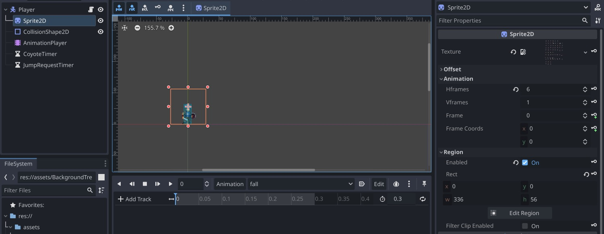
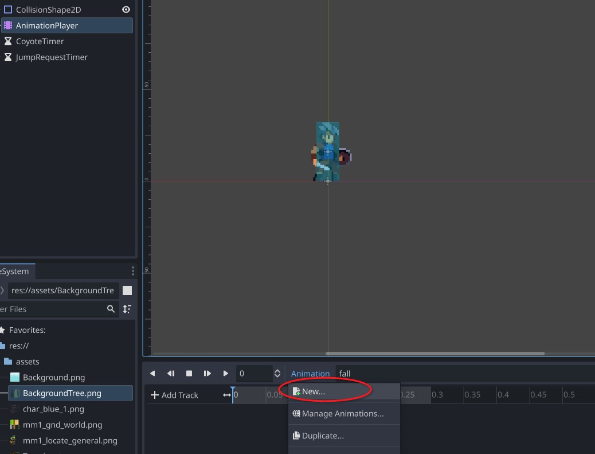
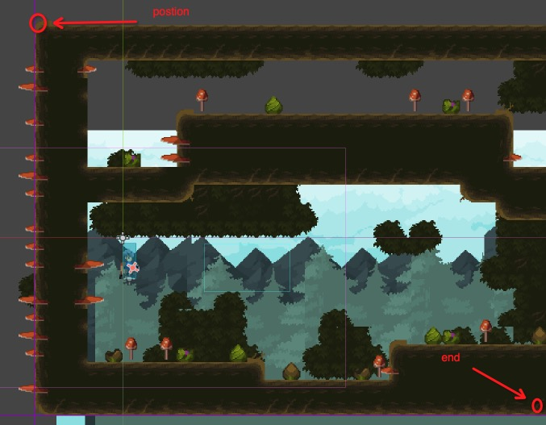

# `Godot`

## `CharacterBody2D` 角色节点

- `CharacterBody2D`： 角色节点，需要添加 `Sprite2D`子节点 和 `CollisionShape2D`子节点
- `Sprite2D`：显示图像（精灵图）

  - `Texture`：添加图片

    > 图片放大后，图片会比较模糊，可以点击:

    `Project`->`Project Settings`->`General`->`Rendering`->`Textures`->`Default Texture Filter`: `Nearest`

  - `Region`: `Enabled`: on 编辑动画帧
  - `Animation`: 设置水平和垂直帧数

- `CollisionShape2D`: 定义碰撞形状

  - `Shape`: 新建碰撞区域，调整适合的位置

    

- `AnimationPlayer` 新建动画

  1. 选择`AnimationPlayer`,点击`Animation`->`New`新建动画，设置时间和是否循环
  2. 选择 `Sprite2D`,右侧属性 `Region`: Rect 添加关键帧，`Hframes`添加关键帧，`frames`添加关键帧

     

## `Camera2D` 相机

用于二维场景的摄影机节点

- `Drag`: 启用 `Horizontal Enabled` `Vertical Enabled` 使得角色在一定范围内可以自由活动，而不是一直相机跟随
- `Position Smoothing`: 启用跟随平滑过渡， `Speed`可以调整跟随速度
- `Limit`: 设置相机可视范围，超出范围隐藏（为了不展示场景之外的空白） `Smoothed`启用平滑



```gdscript
# 代码控制 camera

extends Node2D
@onready var tile_map: TileMap = $TileMap
@onready var camera_2d: Camera2D = $Player/Camera2D

func _ready():
  # 获取tileMap的边界，矩形边框，返回结果的宽高是以图块为单位，需要转换为像素
  var used := tile_map.get_used_rect()
  # 要转换像素，需要先获取每一个图块的大小
  var tile_size := tile_map.tile_set.tile_size

  # 上面 used 返回 Rect2i类型， 其中 position表示矩形左上角的坐标，end表示矩形右下角的坐标
	camera_2d.limit_top = used.position.y * tile_size.y
	camera_2d.limit_left = used.position.x * tile_size.x
	camera_2d.limit_right = used.end.x * tile_size.x
	camera_2d.limit_bottom = used.end.y * tile_size.y
```

## 状态机

`godot`里面子节点是的`_ready()`是优先于父节点的`_ready()`的，所以如果在父节点没有准备的情况下，要等待父节点：

```gdscript
await owner.ready # 等待父节点，确保父节点已经存在
# todo
```

在`gdscript`中，枚举类型是从 0 开始递增的

```gdscript
enum 枚举类型{
  第一个枚举, # 等于 0
  第二个枚举, # 1
  第三个枚举, # 2
}
```

另外取值也是可以自行指定的

```gdscript
enum 枚举类型{
  first = 100,  # 100
  second,       # 101
  third = -3,   # -3
}

```

点击编辑器 `File`->`New Script` 新建脚本文件

```gdscript
# 声明类（自定义节点） 之后可以在节点内添加该节点
class_name StateMachine
extends Node

var current_state: int = -1:
	set(v):
		owner.transition_state(current_state,v) # 实现通知状态从 current_state变化到 v
		current_state = v

func _ready() -> void:
	await owner.ready #owner代表父节点
	current_state = 0


func _physics_process(delta: float) -> void:
	while true:
		var next := owner.get_next_state(current_state) as int
		if current_state == next:
			break
		current_state = next

	owner.tick_physics(current_state,delta) # 调用父节点方法 需要自己实现 tick_physics

```

```gdscript
# player.gd 角色运动脚本

extends CharacterBody2D

enum State {
	IDLE,
	RUNNING,
	JUMP,
	FALL,
	LANDING,
}
const GROUND_STATES := [State.IDLE,State.RUNNING,State.LANDING]
const RUN_SPEED := 160.0
const JUMP_VELOCITY := -300.0
const FLOOR_ACCELERATION = RUN_SPEED / 0.2
const AIR_ACCELERATION = RUN_SPEED / 0.02
var default_gravity := ProjectSettings.get("physics/2d/default_gravity") as float
var is_first_tick := false

@onready var sprite_2d = $Sprite2D
@onready var animation_player = $AnimationPlayer
@onready var coyote_timer: Timer = $CoyoteTimer
@onready var jump_request_timer: Timer = $JumpRequestTimer

func _unhandled_input(event: InputEvent) -> void:
	if event.is_action_pressed("jump"):
		jump_request_timer.start()
	if event.is_action_released("jump"):
		jump_request_timer.stop()
		if velocity.y < JUMP_VELOCITY/2:
			velocity.y = JUMP_VELOCITY / 2


func tick_physics(state: State,delta: float) -> void :
	move(0.0 if is_first_tick and state == State.JUMP else default_gravity,delta)
	is_first_tick = false

func move(gravity: float, delta: float) -> void:
	var direction := Input.get_axis("move_left","move_right")
	var acceleration = FLOOR_ACCELERATION if is_on_floor() else AIR_ACCELERATION
	velocity.x = move_toward(velocity.x,direction * RUN_SPEED, acceleration * delta)
	velocity.y += gravity * delta
	if not is_zero_approx(direction):
		sprite_2d.flip_h = direction < 0

	move_and_slide()

func get_next_state(state: State)-> State:
	var can_jump = is_on_floor() or coyote_timer.time_left > 0
	var should_jump = can_jump and jump_request_timer.time_left > 0
	if should_jump:
		return State.JUMP
	var direction := Input.get_axis("move_left","move_right")
	var is_still := is_zero_approx(direction) and is_zero_approx(velocity.x)
	match state:
		State.IDLE:
			if not is_on_floor():
				return State.FALL
			if not is_still:
				return State.RUNNING

		State.RUNNING:
			if not is_on_floor():
				return State.FALL
			if is_still:
				return State.IDLE

		State.JUMP:
			if velocity.y >=0:
				return State.FALL

		State.FALL:
			if is_on_floor():
				return State.LANDING if is_still else State.RUNNING

		State.LANDING:
			if not animation_player.is_playing():
				return State.IDLE

	return state


func transition_state(from: State, to: State) -> void:
	if from not in GROUND_STATES and to in GROUND_STATES:
		coyote_timer.stop()

	match to:
		State.IDLE:
			animation_player.play("idle")

		State.RUNNING:
			animation_player.play("running")

		State.JUMP:
			animation_player.play("jump")
			velocity.y = JUMP_VELOCITY
			coyote_timer.stop()
			jump_request_timer.stop()
		State.FALL:
			animation_player.play("fall")
			if from in GROUND_STATES:
				coyote_timer.start()

		State.LANDING:
			animation_player.play("landing")
	is_first_tick = true

```
